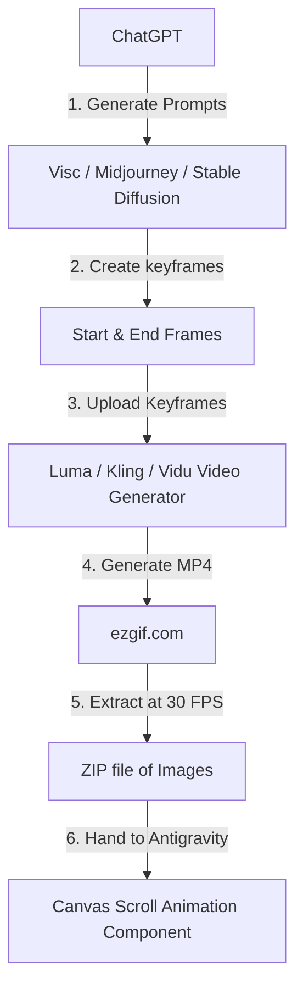

# CareerForge Project Status & Scroll Animation Implementation Guide

This document provides a summary of the current work completed on the **CareerForge** project and outlines the step-by-step AI-driven workflow to build high-performance, Apple-style scroll animations using image/video AI tools.

---

## Part 1: CareerForge Project Status

CareerForge is built as a TypeScript monorepo with an Express backend (`apps/api`) and a Next.js 15 (RC) frontend (`apps/web`), connected by a shared typescript schema package (`packages/shared-types`). The database layer uses Prisma with PostgreSQL.

The following modules and features are fully structured and implemented:

### 1. Backend Architecture (`apps/api`)
- **Authentication**: JWT-based authentication using HTTP-only cookies, password hashing with `bcryptjs`, and token refresh mechanism (`apps/api/src/modules/auth`).
- **Database & ORM**: PostgreSQL database schema structured in Prisma with models representing users, experiences, education, skills, resumes, cover letters, ATS scans, job tracker cards, subscriptions, billing ledgers, audit logs, and notification feeds.
- **Asynchronous Task Queue (BullMQ + Redis)**: Configured background workers. Specifically, a background PDF processing worker (`pdf.worker.ts`) handles resource-intensive resume compiling tasks.
- **Resume & PDF Compilation Service**: Compiles React/HTML resumes into optimized PDFs using `puppeteer` and uploads them to Cloudinary storage.
- **AI Gateway**: Configured to connect with external LLM endpoints for cover letter generation, interview feedback, and ATS keyword extraction.
- **Middlewares & Security**: Implemented validation middleware (Zod schema checking), global error handling, rate limiting (`express-rate-limit`), CORS, and helmet security headers.

### 2. Frontend Architecture (`apps/web`)
- **Next.js 15 app router**: Uses semantic routing for dashboards, resumes, cover-letters, billing, job trackers, profile editing, and administration page groups.
- **State Management & Data Fetching**: Utilizes `zustand` for client-side state tracking and `@tanstack/react-query` for API query/mutation caching.
- **Modern Typography & Rich UI**: Fully styled with Tailwind CSS v4, containing blurred glassmorphic overlays, clean typography, dark theme grids, Framer Motion transitions, and Lucide icons.
- **Job Application Kanban Board**: Custom drag-and-drop workflow tracker built with `@dnd-kit/core` and `@dnd-kit/sortable` to track job application columns (Wishlist, Applied, OA, Interview, Offer, Rejected, etc.).
- **Tiptap Rich-Text Editor**: Customized rich-text fields for building CV bullet points, job descriptions, and cover letters.

---

## Part 2: Scroll-Bound Canvas Animation Workflow

To create smooth scroll animations on a landing page, modern web developers avoid heavy videos (which lag and fail to sync with scroll speed). Instead, we use an **Image Sequence** rendered on an HTML5 `<canvas>` element. 

Here is the exact workflow you can follow to generate the frames and hand them to me to build the scroll animation:



### Step 1: Prompt ChatGPT for Visual Assets
Ask ChatGPT to write highly detailed image prompts for the **Start Frame** (the initial state when the user is at the top of the scroll) and the **End Frame** (the target state when the user completes scrolling). 
*Note: The prompt must instruct ChatGPT to keep the style, color scheme, background, light vectors, and camera angles perfectly identical so the transition will be seamless.*

*(Copy-pasteable ChatGPT prompts are provided in Part 3 below).*

### Step 2: Generate the Frames in "Visc" (or another Image Generator)
1. Run the ChatGPT-generated prompt for the **Start Frame** in your image generator (e.g. Midjourney, Stable Diffusion, or Visc/Vidu). Save the result as `start.png`.
2. Run the **End Frame** prompt. Save it as `end.png`.
3. Check both images: ensure that background elements, color palettes, and camera positions match perfectly. Only the primary object (e.g. a scanner opening, a folders stack expanding, a resume emerging) should be different.

### Step 3: Generate the Transition Video
1. Upload both `start.png` and `end.png` into an AI Video Generator that supports keyframe interpolation (such as **Luma Dream Machine**, **Kling AI**, or **Vidu.studio**).
2. Set `start.png` as the **first frame** and `end.png` as the **last frame**.
3. Generate a 3-second or 4-second video. The AI will interpolate a clean, smooth physics-based animation between your start and end frames.
4. Download the generated video file (usually an `.mp4`).

### Step 4: Extract Frames using ezgif
1. Go to **[ezgif.com](https://ezgif.com)** and click on the **"Video to GIF"** or **"Video to JPG"** tool.
2. Upload your generated `.mp4` video.
3. Set the **Frame Rate (FPS)** to **30**.
4. Click **Convert**. The tool will slice the video into a sequence of individual static frames (e.g. `frame_001.png` to `frame_090.png`).
5. Download the output as a **ZIP archive** containing the individual images.

### Step 5: Hand the Frames to Me (Antigravity)
Extract the image sequence files into a directory in the project (for example: `apps/web/public/assets/scroll-sequence/`). 

Once you provide the images, I will write the Next.js component to handle the scroll-bounded canvas rendering. Below is an example of the component I will build for you:

```tsx
"use client";

import React, { useRef, useEffect } from "react";

interface ScrollCanvasProps {
  frameCount: number;
  basePath: string; // e.g. "/assets/scroll-sequence/frame_"
  extension: string; // e.g. ".png"
  width: number;
  height: number;
}

export default function ScrollCanvas({ frameCount, basePath, extension, width, height }: ScrollCanvasProps) {
  const canvasRef = useRef<HTMLCanvasElement>(null);
  const imagesRef = useRef<HTMLImageElement[]>([]);

  useEffect(() => {
    // 1. Preload images into memory for zero-lag rendering
    for (let i = 1; i <= frameCount; i++) {
      const img = new Image();
      // Format number to match file sequence, e.g. 001, 002
      const formattedNum = String(i).padStart(3, "0");
      img.src = `${basePath}${formattedNum}${extension}`;
      imagesRef.current.push(img);
    }

    // Draw first frame once loaded
    imagesRef.current[0].onload = () => {
      drawFrame(0);
    };

    const handleScroll = () => {
      const canvas = canvasRef.current;
      if (!canvas) return;

      const html = document.documentElement;
      // Calculate scroll fraction within the scroll track container
      const scrollHeight = html.scrollHeight - window.innerHeight;
      const scrollTop = html.scrollTop;
      const scrollFraction = scrollTop / scrollHeight;

      // Map scroll fraction to image sequence frame index
      const frameIndex = Math.min(
        frameCount - 1,
        Math.floor(scrollFraction * frameCount)
      );

      requestAnimationFrame(() => drawFrame(frameIndex));
    };

    const drawFrame = (index: number) => {
      const canvas = canvasRef.current;
      const ctx = canvas?.getContext("2d");
      const img = imagesRef.current[index];

      if (canvas && ctx && img && img.complete) {
        ctx.clearRect(0, 0, canvas.width, canvas.height);
        ctx.drawImage(img, 0, 0, canvas.width, canvas.height);
      }
    };

    window.addEventListener("scroll", handleScroll);
    return () => window.removeEventListener("scroll", handleScroll);
  }, [frameCount, basePath, extension]);

  return (
    <div className="sticky top-0 h-screen w-full flex items-center justify-center overflow-hidden bg-black">
      <canvas
        ref={canvasRef}
        width={width}
        height={height}
        className="max-w-full max-h-full object-contain"
      />
    </div>
  );
}
```

---

## Part 3: Copy-Paste Prompts for ChatGPT

To start the process, copy and paste the prompt template below into ChatGPT to get your frame prompts.

```text
Act as a professional creative director and visual designer. I want to create a premium scroll-animation on a modern dark-themed resume builder website (called CareerForge). The scroll animation represents a "Resume Scanner" where a document is scanned and parsed by AI.

Please write two detailed visual prompts for an AI image generator (such as Midjourney, Stable Diffusion, or Vidu):
1. **Start Frame Prompt**: The initial visual state. A closed, glowing holographic folder floating in a dark digital space with blue and purple accent lights, thin grid lines, and soft bokeh effects in the background. The camera is centered, close-up, and direct.
2. **End Frame Prompt**: The final visual state. The exact same folder, background, lighting, camera position, and scale. However, the folder is now open, green scanning lasers are actively projecting upwards, and a sleek, modern, glowing semi-transparent resume page rises out of the folder.

Crucial Constraints to write in both prompts:
- Both prompts must have the exact same camera angle, focal length, lighting coordinates, background grids, and color values (Navy blue #0D1117, Indigo #3F51B5, and Electric purple).
- Only the folder's physical state (open/closed, laser presence, rising resume document) should change.
- Format the final output clearly as two separate prompt copy blocks so I can run them sequentially.
```

---

## Summary of Next Steps
1. Copy the ChatGPT prompt above to generate your specific frame prompts.
2. Generate **`start.png`** and **`end.png`** in your image generator.
3. Upload them to a video generator (Luma, Kling, or Vidu) and compile the transition `.mp4`.
4. Upload to **ezgif.com**, slice into frames at **30 FPS**, and download the ZIP file.
5. Create a folder in `apps/web/public/assets/scroll-sequence/` and unzip your frames there.
6. Let me know, and I will write and wire up the interactive React scroll-bound canvas component in `apps/web`!
